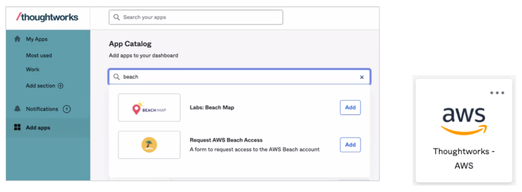
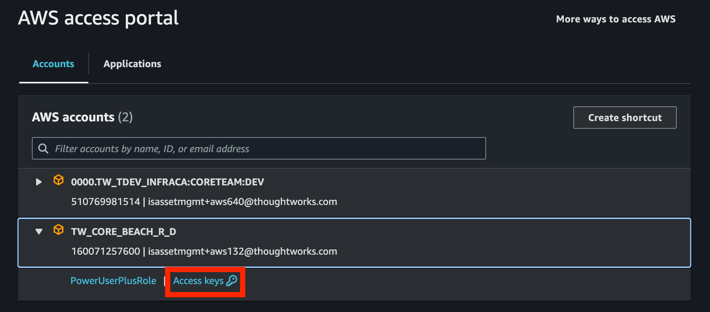

# infra-as-code
# Infra as Code - VLD's Lab Exercises

## Overview

This code repository accompanies the slides, videos and demo code for the Infra as Code course which has 6 sessions. There is a folder for each session which contains the session's lab exercises. As we work through the sessions we will make improvements to the code base which builds a working solution. In each of the sessions we will follow the same authentication, deployment and destruction processes which can be found below. The course trainer will share the solutions to the lab exercises after you have completed them.

## Sessions

- [Session_1_IaC_and_Terraform_Intro](./Session_1_IaC_and_Terraform_Intro/README.md)
- [Session_2_Terraform_Basics](./Session_2_Terraform_Basics/README.md)
- [Session_3_Terraform_State](./Session_3_Terraform_State/README.md)
- [Session_4_Terraform_Tips_n_Tricks](./Session_4_Terraform_Tips_n_Tricks/README.md)
- [Session_5_Terraform_Modules](./Session_5_Terraform_Modules/README.md)
- [Session_6_Terraform_Cloud_and_Pipelines](./Session_6_Terraform_Cloud_and_Pipelines/README.md)


### Pre-requisites

#### AWS Console Access

You can grant permissions for yourself to access the TW AWS beach account via Okta.  Click on “Add apps” in the left hand menu, type “beach” into the search field, click “Add” next to “Request AWS Beach Access”, then you should have a new tile available for AWS access.




#### AWS CLI Installed and Configured

Before trying to access the TW AWS Beach account via the CLI you should have already added it via Okta, see above.

To install AWS CLI run the following if it's not already installed:

```
brew install awscli
```

For the AWS CLI to authenticate with AWS from your laptop you will need to configure a profile which provides authentication configuration.  The AWS beach account (along with most TW AWS accounts) is configured to use Single Sign-On (SSO) therefore the profile should have SSO configuration.  Once a profile is created you can run the `aws sso login` command in a terminal using the AWS CLI and reference your profile as an input parameter in the command.  This will open a web page hosted by AWS which asks you to authorise the authentication request.  Assuming you authorise the request via the web page then the terminal will recognise this and your AWS CLI will now be authenticated.  This authenticated session uses short lived credentials provided by AWS STS (Security Token Service) which by default will expire after 12 hours after which you will have to re-authenticate.  You can ensure your profile is recognised in the terminal for all future AWS CLI commands by adding the AWS_PROFILE environment variable.  I'll now step you through configuring this.

1. Firstly, you need to create the AWS profile by adding this snippet of code into `~/.aws/config`.  You should do this only if you don’t already have it configured (also create the config file if it doesn't exist).  In the snippet below you can optionally update the profile name, region and output as you see fit:

```
[profile twbeach]
sso_start_url = https://thoughtworks-sso.awsapps.com/start
sso_region = eu-central-1
sso_account_id = 160071257600
sso_role_name = PowerUserPlusRole
region = ap-southeast-2
output = json
```

2. Now you can test authenticating with AWS by running the following command in your terminal (update the profile name to the profile you are using).

```
aws sso login --profile twbeach
```

3. It should open a browser window and will prompt you to authorise the request.  Once authorised you should run the following to set your AWS profile as an environment variable in your terminal (update the profile name to the profile you are using):

```
export AWS_PROFILE=twbeach
```

4. If you wish to use environment variables to authenticate, click on `Access Keys` in the AWS Sign In portal (accessible by clicking on AWS Beach tile in your OKTA dashboard) as shown below:

   

   Copy and paste the keys into a new terminal, and that's it! You should now be authenticated. Do keep in mind that the keys are valid only for a few hours and only for the current terminal where they are set. If you open a new terminal, or if you wish to reauthenticate after several hours, you will have to repeat the process.

5. Now if you run any AWS commands it will detect you are already authenticated and you should be able to interact with AWS from the command line using the AWS CLI.  Here's some commands you can run to test it out:

```
aws sts get-caller-identity
aws ec2 describe-regions
```

You are now ready to proceed with the exercise.


#### Install Terraform

[Installation instructions](https://developer.hashicorp.com/terraform/tutorials/aws-get-started/install-cli)

#### Update the Region (If Applicable)

In the region variable or in the \*.tfvars file there is a value specified for the region, you should update the region to match your AWS profile region (NOT the `sso-region`, just the `region` option).

### Deploy Instructions:

Navigate to the root of the session folder and then run the following command to initialise the Terraform project, this will pull down the Terraform modules required by the code:

```
terraform init
```

Run the following command to see if the Terraform is valid and identify what resources it plans to create, update or destroy:

```
terraform plan
```

Run the following command to deploy the Terraform and create the resources.

```
terraform apply
```

Once the script has completed it should return the Terraform output data. You should also log in to the AWS console and have a look at the resources that were created.

Run the following command to view the resources that Terraform created:

```
terraform state list
```

> [!TIP]
> During these exercises, as seen in the videos, if you save variable values in a file with `.tfvars`, you must specify this as a parameter to Terraform. Otherwise, when you run commands like `terraform plan` or `terraform apply`, it will prompt you for the relevant variable values.

> As mentioned in the video, if you end the name of your variable file with `.auto.tfvars`, Terraform will automatically take these as default parameters without needing any additional input. Otherwise, you can use it as follows:

```bash
terraform plan -var-file=example.tfvars
```
> or

```bash
terraform apply --var-file example.tfvars
```

### Destroy Instructions:

Run the following command to destroy all the resources:

```
terraform destroy
```

Log in to the AWS console to verify all the resources have been terminated.
